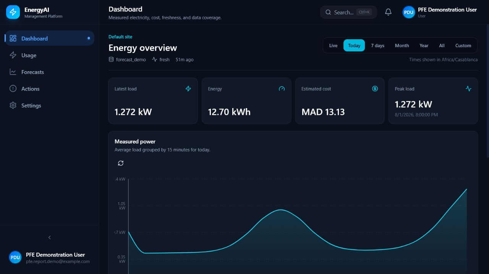

<div align="center">

<h1>EnergyAI</h1>
<h3>Evidence-aware electricity monitoring and multi-horizon forecasting</h3>
<p><strong>Product V1 · FastAPI · Next.js 16 · PostgreSQL 16 · Global TFT</strong></p>
<p>
EnergyAI turns owned smart-meter readings into live monitoring, tariff-aware<br>
analytics, operational alerts, and probabilistic 24-hour or 168-hour energy<br>
forecasts—without hiding missing data, model fallbacks, or deployment limits.
</p>

</div>



> **Release status:** Product V1 is publicly deployed on Microsoft Azure for
> controlled academic demonstration and supervisor/jury review. The verified
> release includes HTTPS web/API access, managed PostgreSQL, both packaged
> forecasting artifacts, transactional email delivery, and Google signup. It is
> not presented as a globally validated or fully hardened production service.

## Contents

- [Why EnergyAI](#why-energyai)
- [Product capabilities](#product-capabilities)
- [Forecasting contract and evidence](#forecasting-contract-and-evidence)
- [Architecture](#architecture)
- [Quick start with Docker Compose](#quick-start-with-docker-compose)
- [Local development](#local-development)
- [Data ingestion](#data-ingestion)
- [Security and ownership](#security-and-ownership)
- [Quality evidence](#quality-evidence)
- [Repository structure](#repository-structure)
- [Known boundaries](#known-boundaries)
- [Documentation](#documentation)

## Why EnergyAI

Energy dashboards often stop at attractive charts or display forecasts without
showing whether the input was complete, which model ran, or whether a fallback
was substituted. EnergyAI treats those details as part of the product contract.

The V1 workflow is intentionally focused:

```text
Register or sign in
        ↓
Configure one owned site and its primary meter
        ↓
Import CSV data, push readings, or use the labelled demo simulator
        ↓
Inspect consumption, cost, freshness, gaps, and coverage
        ↓
Run a gated 24-hour or 168-hour forecast
        ↓
Review uncertainty, provenance, alerts, and evidence-backed actions
        ↓
Export owned data and reports
```

The platform never exposes a research notebook as a production model selector.
Only fixed, hash-verified artifacts that pass their manifest and warm-up checks
can be advertised by the API.

## Product capabilities

### Monitoring and analytics

- Live authenticated monitoring over WebSocket plus historical REST views.
- Live, current Today, current Week, current Month, current Year, All, and Custom time ranges using site-local calendar boundaries.
- Coverage-gated Today/Week/Month estimates, monthly-budget status, and explicit previous-month daily-average comparison.
- Energy, peak load, estimated tariff cost, freshness, coverage, and gap context.
- Source-aware readings for CSV, push API, simulator, and forecast-demo data.
- Bounded raw-reading pagination and monthly CSV/PDF exports.

### Data acquisition

- CSV preview and confirmed import with schema, size, row, ownership, and
  timestamp validation.
- Per-meter push API keys with one-time reveal, rotation, idempotency, and
  last-seen state.
- An explicitly labelled deterministic simulator for demonstrations and development. A first start on an empty meter prepares 30 days of 15-minute household history; an already-running session catches up forward after a backend sleep, while old, CSV, push, and deliberately stopped gaps remain untouched.
- A confirmed “Reset demo data” action replaces only `source="simulation"` rows with the same seeded scenario and preserves measured/imported readings.
- One private site and one primary meter per normal user in Product V1.

### Forecasting

- Independently packaged Global TFT models for the next 24 and 168 hourly kWh
  values.
- q10, q50, and q90 predictions with clear uncertainty visualization.
- Coverage, missing-gap, lookback, artifact-integrity, and runtime-readiness gates.
- Labelled seasonal-naive fallback if an accepted input cannot complete TFT
  inference.
- Persisted model name, version, horizon, preprocessing provenance, target
  timestamps, fallback reason, and quantiles.
- Forecast PDF export; the week view aggregates the 168 hourly medians into
  readable local-day totals while retaining all hourly targets.

### Alerts and actions

- Evidence-backed high-load and missing-push-data alerts.
- Configurable thresholds, cooldowns, acknowledgement, and resolution lifecycle.
- Deterministic recommendations tied to the alert that generated them.
- Optional critical-alert email delivery through the transactional outbox.

### Accounts and administration

- Access-token plus rotating HttpOnly refresh-cookie sessions.
- Email verification and password recovery when delivery is configured.
- Server-verified Google identity/link/unlink flow; the public Azure release is
  configured with a production Google Web OAuth client.
- Profile images accept validated JPEG, PNG, WebP, HEIC, and HEIF input, then normalize it to sanitized WebP with bounded dimensions and durable cleanup jobs.
- Administrative lifecycle reporting distinguishes pending verification, active, and disabled accounts without bypassing verification.
- Owner archive/export and reauthenticated irreversible account deletion.
- Admin-only user access control, aggregate statistics, audit visibility, and
  read-only model/system readiness.

## Forecasting contract and evidence

Every Product V1 forecast requires:

| Gate | Requirement |
|---|---|
| History | Latest 336 hourly energy values from the authenticated user's primary meter |
| Coverage | At least 95% observed coverage |
| Missing data | No unresolved gap longer than 3 hours |
| Numeric validity | Finite values after bounded interpolation |
| Artifact | Manifest, byte size, SHA-256, strict state loading, and warm-up must pass |
| Normalization | Rolling 336-hour per-site z-score used by the serving pipeline |

The deployed checkpoints were evaluated without retraining on the preserved
Low Carbon London cold-start cohort using the exact production normalization
and inverse-transformation path:

| Serving-normalization result | 24 hours | 168 hours |
|---|---:|---:|
| Evaluated households | 500 | 499 |
| Evaluation windows | 11,871 | 11,830 |
| Macro MAE | 0.181945 kWh | 0.194138 kWh |
| Seasonal-naive macro MAE | 0.251540 kWh | 0.249055 kWh |
| Households beating seasonal naive | 498/500 (99.60%) | 496/499 (99.40%) |
| Central-80% empirical coverage | 81.011% | 78.056% |

These are frozen-cohort evaluation results, not a guarantee for a new client
site. Site-specific accuracy and calibration require actual post-deployment
outcomes. The exact origins, hashes, environment, parity checks, and
per-household outputs are recorded in the
[serving-normalization manifest](report/evidence/lcl_tft_serving_normalization_manifest.json).

Artifact contracts:

- [24-hour Global TFT](docs/FORECAST_ARTIFACT.md)
- [168-hour Global TFT](docs/FORECAST_168H_ARTIFACT.md)

## Architecture

```text
┌─────────────────────────────────────────────────────────────┐
│ Next.js 16 / React 19                                       │
│ Dashboard · Usage · Forecasts · Actions · Settings · Admin  │
└──────────────────────────────┬──────────────────────────────┘
                               │ REST + authenticated WebSocket
┌──────────────────────────────▼──────────────────────────────┐
│ EnergyAI API v1.0 / FastAPI                                 │
│ Auth · ownership · ingestion · analytics · reports · policy │
├──────────────────┬───────────────────────┬──────────────────┤
│ PostgreSQL 16    │ Global TFT artifacts  │ Durable workers  │
│ SQLAlchemy       │ 24h + gated 168h      │ alerts · email   │
│ Alembic          │ manifests + hashes    │ avatar cleanup   │
└──────────────────┴───────────────────────┴──────────────────┘
```

The Compose deployment contains six services:

| Service | Responsibility |
|---|---|
| `db` | PostgreSQL 16 persistence |
| `backend` | FastAPI application, policy, reports, and forecast inference |
| `frontend` | Next.js user and administrator interface |
| `alerts-worker` | Missing-data and threshold alert processing |
| `email-worker` | Transactional outbox delivery, retry, and dead-letter handling |
| `avatar-cleanup-worker` | Durable removal of superseded avatar objects |

Normal users never provide an arbitrary site or meter identifier to choose the
data being queried. The backend resolves the authenticated user's owned site and
primary meter server-side.

## Quick start with Docker Compose

### Prerequisites

- Docker Engine or Docker Desktop
- Docker Compose v2
- Approximately 12 MB for the two packaged model checkpoints, in addition to
  container images and database storage

### 1. Configure the release

From the repository root in PowerShell:

```powershell
Copy-Item .env.example .env
```

Open `.env` and replace every `replace_with_...` value. At minimum, provide:

- a strong PostgreSQL password;
- a JWT secret of at least 32 characters;
- an administrator password of at least 12 characters;
- the legal owner, contact, support, and effective-date values required when
  `DEBUG=false`.

The example enables the packaged 168-hour model. Email delivery and Google
authentication remain disabled until their complete external configuration is
supplied and tested.

### 2. Start and verify the stack

```powershell
docker compose config --quiet
docker compose up --build -d
docker compose ps
docker compose exec backend python -m app.cli create-admin
```

Open:

- Application: <http://localhost:3000>
- Interactive API: <http://localhost:8000/docs>
- Readiness: <http://localhost:8000/api/v1/system/ready>

Inspect logs when a service does not become ready:

```powershell
docker compose logs --tail 150 backend frontend alerts-worker email-worker avatar-cleanup-worker
```

Stop the application without deleting its volumes:

```powershell
docker compose down
```

See the [operations guide](docs/operations.md) before changing public origins,
enabling external providers, backing up data, restoring a database, or rotating
credentials.

## Local development

### Requirements

- Python 3.11
- Node.js 20 and npm
- PostgreSQL 16 for production-equivalent database behavior; SQLite is available
  for a smaller development profile

### Backend

```powershell
Copy-Item backend\.env.example backend\.env
Set-Location backend
python -m pip install -r requirements-dev.txt
python -m pip install -r requirements-ml.txt
python -m app.cli migrate
python -m app.cli create-admin
python -m uvicorn app.main:app --reload --port 8000
```

`requirements-ml.txt` installs CPU PyTorch and is required for local TFT
inference. The ordinary CI test image can exclude Torch to keep its resource
usage bounded; artifact contract tests run in an ML-enabled target.

### Frontend

In another terminal:

```powershell
Set-Location frontend
npm ci
$env:NEXT_PUBLIC_API_URL = "http://localhost:8000"
npm run dev
```

### Useful checks

```powershell
# Backend
Set-Location backend
python -m pytest -q

# Frontend
Set-Location ..\frontend
npm run lint
npm run typecheck
npm run build
npm run test:browser
```

## Data ingestion

### CSV contract

CSV files must be UTF-8 and contain:

- `timestamp`, including a timezone or unambiguous ISO-8601 offset;
- `active_power_kw`, or the accepted `GAP` alias.

Optional columns include `reactive_power_kvar`, `voltage_v`, and `current_a`.
The web import is bounded to 5 MiB and 10,000 rows, with preview and validation
before persistence.

```csv
timestamp,active_power_kw,voltage_v
2026-08-05T08:00:00+01:00,0.42,230.1
2026-08-05T08:05:00+01:00,0.47,230.4
```

### Push API

Users create a meter key in Settings. It is shown once and should be stored by
the sending device. The API rejects invalid, duplicated, out-of-order, oversized,
or meter-incompatible batches and supports idempotent retry behavior. Consult the
live OpenAPI contract at `/docs` for the current request and response schemas.

## Security and ownership

Product V1 includes:

- bcrypt password hashing and short-lived access tokens;
- hashed, rotating refresh tokens in HttpOnly cookies;
- trusted-origin checks on cookie-mutating session operations;
- neutral, rate-limited account recovery responses;
- hashed single-use verification/reset tokens;
- RBAC plus server-side ownership resolution;
- one-time Google state/nonce challenges when that integration is enabled;
- bounded CSV, push, avatar, and report operations;
- full-history secret scanning in CI;
- startup rejection of insecure release secrets or incomplete legal/provider
  configuration.

Do not commit `.env` files, API keys, SMTP credentials, Google secrets, database
backups, client data, or new research checkpoints. Use an external secret manager
for any public deployment.

## Quality evidence

The latest full application audit was recorded on 31 July 2026. Its verified
snapshot reported:

| Gate | Result |
|---|---|
| Backend with SQLite | 106 passed; 4 explicit PostgreSQL-only skips |
| Backend with isolated PostgreSQL | 100 passed; 0 skipped |
| Frontend lint, type check, production build | Passed; 25 routes generated |
| Playwright six-project matrix | 180/180 passed across desktop, 360 px, 390 px iPhone, and 768 px profiles |
| Production npm dependency audit | 0 known vulnerabilities |
| Production Python dependency audit | 0 known vulnerabilities |
| Compose runtime | Six services running; core health checks passed |
| Forecast readiness | 24-hour and 168-hour artifacts warmed and ready |

This combines the historical isolated-PostgreSQL evidence with the final local
release gate executed on 9 August 2026. The latter also passed production npm and
Python dependency audits with zero known vulnerabilities and completed the full
180-test browser matrix without interruption.

Read the [full application audit](docs/PFE_FULL_APP_AUDIT_2026-07-31.md) and
[Product V1 validation evidence](docs/PRODUCT_V1_G7_VALIDATION_EVIDENCE.md) for
the exact environment, boundaries, and operator-owned checks.

## Repository structure

| Path | Purpose |
|---|---|
| `backend/app/` | FastAPI application, domain services, security policy, and ML runtime |
| `backend/alembic/` | Versioned database migrations |
| `backend/model_artifacts/` | Production-only 24-hour and 168-hour checkpoint packages |
| `backend/tests/` | API, ownership, database, security, worker, and model-contract tests |
| `frontend/src/` | Next.js application, components, API client, and browser-facing policy |
| `frontend/tests/` | Playwright Product V1 journeys |
| `scripts/` | Backup, restore, and operational helpers |
| `docs/` | Architecture, release, operations, audit, and validation records |
| `report/source/` | LaTeX PFE report source |
| `report/evidence/` | Reproducibility manifests and evaluation outputs |
| `models/`, `notebooks/`, `experiments/` | Local research history; never loaded by the production service |

## Known boundaries

The following remain outside the verified Product V1 public-deployment claim:

- No custom domain, CDN, or production load test is included; the verified public
  deployment uses Azure-managed HTTPS hostnames.
- SMTP delivery, the cloud email worker, and Google OAuth origin configuration are
  enabled and smoke-tested in Azure, but sustained provider delivery and recovery
  behavior have not been load-tested.
- Azure alert and avatar-cleanup workers are not deployed, and avatars are not yet
  stored in durable object storage.
- Monthly forecasting is not a production capability.
- There are no utility pull connectors, subscriptions, billing, remote appliance
  control, battery dispatch, or automated demand response.
- Product V1 intentionally supports one site and one primary meter per normal user.
- Forecast accuracy and interval calibration are not guaranteed for a new site;
  client-specific outcomes must be measured after deployment.
- Horizontal API scaling requires a shared rate-limit backend and reviewed worker
  topology.

These boundaries are deliberate. They keep the product demonstrable and truthful
while separating completed engineering from future work.

## Documentation

- [Operations, backup, restore, and release handoff](docs/operations.md)
- [Product V1 release notes](docs/PRODUCT_V1_RELEASE_NOTES.md)
- [Product V1 validation evidence](docs/PRODUCT_V1_G7_VALIDATION_EVIDENCE.md)
- [Full application audit](docs/PFE_FULL_APP_AUDIT_2026-07-31.md)
- [24-hour forecast artifact](docs/FORECAST_ARTIFACT.md)
- [168-hour forecast artifact](docs/FORECAST_168H_ARTIFACT.md)
- [PFE report QA](report/qa/final_report_qa.md)

## Academic context and license

EnergyAI is the Master's Final-Year Project of **Salah Eddine Zouitni** in the
Master's programme in Data Science and Artificial Intelligence at the Faculty of
Sciences of Meknès, Université Moulay Ismaïl, under the academic supervision of
**Pr. Ali Oubelkacem**.

No open-source license is currently included. The repository should not be
treated as granting redistribution or commercial-use rights until an explicit
license is added.
