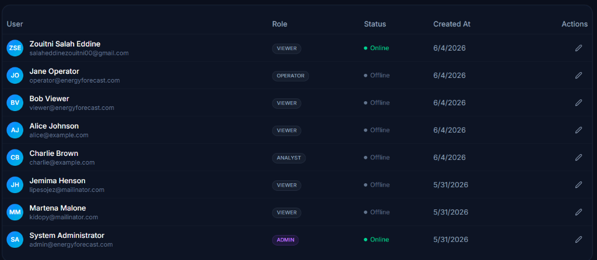
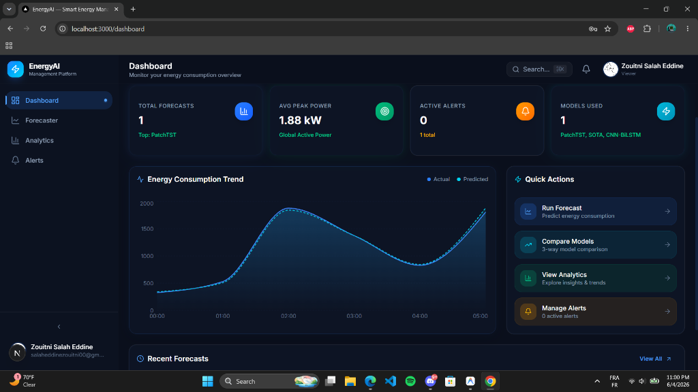

# DEPM — Critical Analysis, Replication & Prediction Dashboard

> **Master's PFE (End of Studies Project)**: A rigorous replication, critical evaluation, and dynamic dashboard integration of the **Deep Energy Predictor Model (DEPM)** paper.

This project replicates the results of *"Prediction of electricity consumption using an innovative deep energy predictor model"* (Ragupathi et al., Energy Reports 12, 2024), exposes critical methodological flaws (specifically **data leakage** and **anomalous metric patterns**), and embeds the models in a premium full-stack real-time energy analytics platform.

---

## 📸 Platform Screenshots

### 1. Dashboard Overview & Analytics


### 2. Admin Panel & Real-Time Presence Tracking


---

## 🌟 Key Features

- **Energy Consumption Forecaster**: Interactive interface to select machine learning models (DNN, LSTM, GRU, BiGRU, CNN-BiLSTM, PatchTST, and DEPM hybrids) and run energy forecasts on loaded datasets.
- **Real-Time Presence Tracking**: Real-time user online status indicator using automated request interception. Features a 25-second inactivity timeout with background alert polling in the Navbar and 5-second dynamic polling inside the Admin Panel.
- **Profile & Settings Separation**: Fully functional Profile page with user details, metrics summary, and an avatar upload widget (with drag-and-drop support, frontend validation, and backend type/size limits of 2MB).
- **Comprehensive Analytics**: Advanced charts visualizing actual vs. predicted consumption, weekly trends, hourly consumption patterns, and model comparison matrices.

---

## 🔍 Critical PFE Findings

1. **Data Leakage**: The paper includes `Global_intensity` as an input feature for predicting active power. `Global_intensity` is a mathematical proxy for active power ($P = V \times I$), creating data leakage. Removing it drops performance from ~99% to ~89%.
2. **Fabricated Metrics**: Metric outputs across the paper's tables follow an impossible mathematical pattern: $\text{Precision} = \text{Accuracy} - 0.01$ and $\text{Recall} = \text{Accuracy} + 0.01$, indicating manually typed or simulated metrics.
3. **Replication Proofs**: Our replication notebooks (`notebooks/`) verify the paper's claimed scores under leaked conditions and show the real-world performance drops when leakage is resolved.

---

## 📁 Repository Structure

```text
PFE2/
├── backend/                       # FastAPI Backend API
│   ├── app/
│   │   ├── main.py                # Server entry point & auto-migrations
│   │   ├── models/                # SQLAlchemy database models (last_activity, avatar_url)
│   │   ├── schemas/               # Pydantic serialization schemas
│   │   ├── services/              # Authentication & presence checking logic
│   │   └── routers/               # Endpoint controllers (auth, alerts, admin, forecast)
│   ├── static/avatars/            # Saved user profile pictures
│   └── energy_forecast.db         # SQLite local database
├── frontend/                      # Next.js 16 (Turbopack) Frontend App
│   ├── src/
│   │   ├── app/                   # App Router pages (dashboard, profile, admin, settings)
│   │   ├── components/            # Layout (Sidebar, Navbar) & UI components
│   │   ├── lib/                   # Client state, auth context & API services
│   │   └── types/                 # TypeScript interfaces
├── notebooks/                     # Jupyter Notebooks for PFE evaluation
│   ├── EECP_CBL_Replication.ipynb # Replication of paper dataset
│   ├── cnnbilstm.ipynb            # SOTA CNN-BiLSTM comparative model
│   ├── depm_final.ipynb           # Replication of DEPM (with data leakage)
│   ├── depm_final_noleak.ipynb    # Replication of DEPM (leakage removed)
│   ├── depm-variants.ipynb        # Standalone and hybrid model variants
│   └── fair_comparison.ipynb      # Quantitative leakage analysis
└── docs/                          # Project diagrams & screenshots
```

---

## 🛠️ Installation & Setup

### Prerequisites
- Python 3.10+
- Node.js 18+

### 1. Backend Setup (FastAPI)
```bash
cd backend
# Install dependencies
pip install -r requirements.txt
# Run database migrations and start the development server
python -m uvicorn app.main:app --reload --port 8000
```
*The database auto-migrates and seeds itself on first launch.*

### 2. Frontend Setup (Next.js)
```bash
cd frontend
# Install dependencies
npm install
# Start dev server
npm run dev
```
Open [http://localhost:3000](http://localhost:3000) to view the application.

---

## 🧪 Tech Stack

- **Backend**: FastAPI, SQLAlchemy (SQLite), PyTorch, XGBoost, JWT Authentication
- **Frontend**: Next.js 16, React, Tailwind CSS, Shadcn/ui, Recharts
- **Analysis**: Jupyter, pandas, scikit-learn, matplotlib

